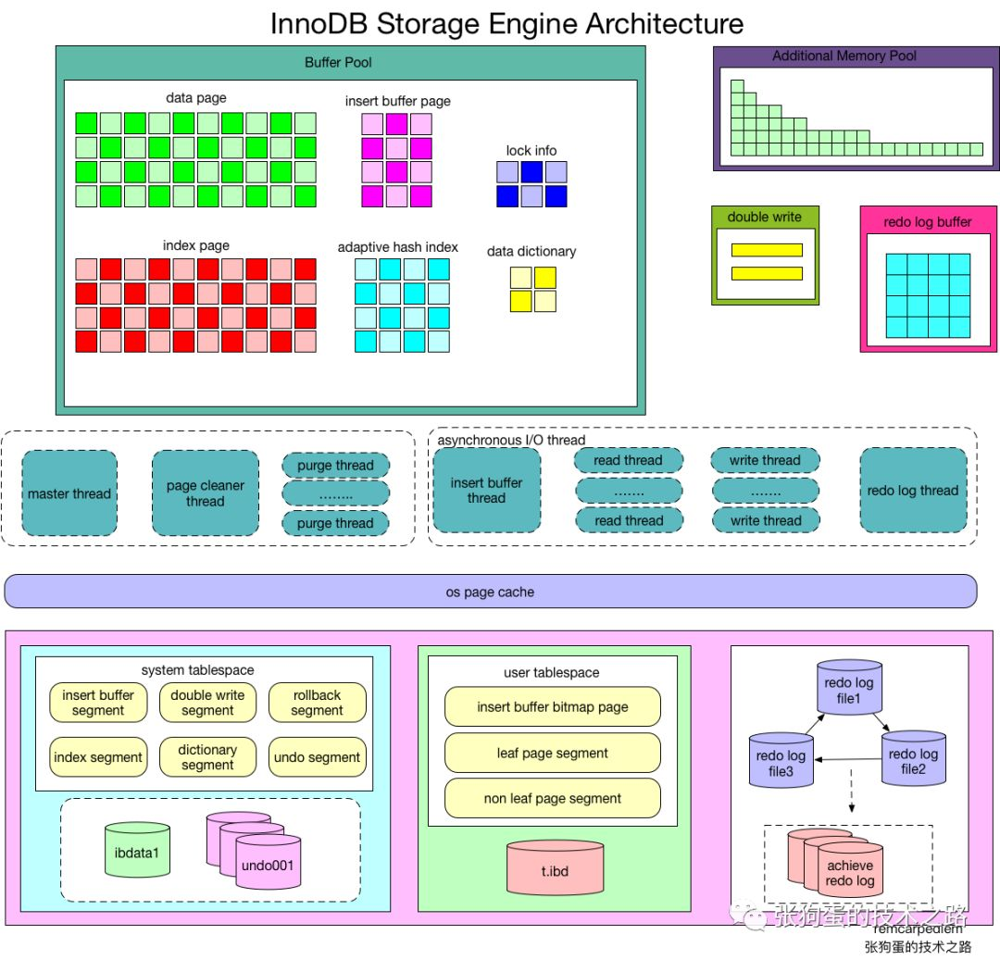

#### 1.MYSQL松散索引扫描

松散索引扫描：按照不连续的方式扫描一个索引。
MySQL不支持，只能定义起点终点，扫描这区间的所有条目。但特殊条件下可以支持。

```SQL
#extra指令显示这行表示使用了松散索引扫描
Using index for group-by
```

group by 操作在没有合适索引可用时，通常先扫描整个表提取数据并创建一个临时表，然后按group by指定的列进行排序。

```sql
Using temporary; Using filesort
```

紧凑索引遍历，即按索引全表扫描。

松散索引扫描，先分组，然后在每个分组的范围内通过索引快速扫描需要找到的列。

比如

```mysql
#字段a b 建立了联合索引（a,b）
#字段b没有索引，此时就是紧凑索引扫描
SELECT * FROM TABLE WHERE b = 1
#此时查询就先通过a分组,然后使用索引查询b
SELECT * FROM TABLE WHERE b = 1 group by a
```


#### 2.顺序插入

以主键大小为基础插入大量数据到数据库中，因为数据库相应部分已经被读取到内存中，插入将会很快。

#### 3.SQL执行过程

查询缓存（8.0弃用）-》SQL解析；预处理  -》 查询优化器 -》执行计划（调用引擎层API）
缓存是完全依赖于SQL语句，不会被解析器优化器影响。

**缓存**系统跟踪缓存中的每个表，当表更新，所有相关缓存数据失效。MySQL把缓存放在一个引用表中，通过hash引用（包含查询本身 版本 数据库 等影响查询结果的因素）存储。

**解析器**通过关键字对SQL语句进行解析，生成解析树，MySQL解析器使用MySQL语法规则验证解析查询。**预处理器**根据一些规则进一步解析语句是否合法，检查数据表和数据列是否存在，名字和别名是否有歧义。

**查询优化器**通过解析树生成执行计划，一条查询可以有多种执行方法，最后都是返回相同结果。优化器寻找其中最好的执行计划。生成执行计划的过程耗费较多时间，所以有执行计划缓存，当类似的语句再次被输入服务器时，就可以直接使用已缓存的执行计划，跳过SQL语句生成执行计划的过程，提升语句执行速度。

```xml
MySQL使用基于成本的查询优化器(Cost-Based Optimizer，CBO)。它会尝试预测一个查询使用某种执行计划时的成本，并选择其中成本最少的一个。
```

在MySQL中，执行器是一个数据结构，不是生成的字节码。

MySQL返回结果集是一个增量，逐步返回的过程，查询到第一条结果时就可以向客户端逐步返回结果集了。

#### 4.innodb特性

MVCC提供高并发性，实现已提交读，可重复读两个隔离级别。通过next-key-lock避免幻读产生。还提供了以下特性。 

```xml
1.插入缓冲（insert buffer）
2.二次写(double write)
3.自适应哈希索引(adaptive hash index)
4.预读（read ahead）
等

innodb组成
1.缓存池
2.后台线程
3.磁盘文件
```

##### 1.插入缓冲

插入数据时，如果按照主键顺序插入（主键索引自增，直接插入数据）,可以获得较高的插入性能，因为读取一次页可以插入多次数据，数据是顺序存放的，效率比较高，但如果存在非聚簇索引，插入数据对于非聚簇索引的叶子节点来说不一定是顺序的，随机读取索引页导致性能下降。 所以insert buffer的优化方法为对于要插入或更新的普通索引，如果缓冲池中有对应的页则直接插入，没有的话则存入到insert buffer中，定期通过后台线程进行合并操作，这样通常可以把多个读取操作页合并为一个，提高了性能。

##### 2.二次写

double write用于保证数据页的可靠性，分为两部分，在内存中有2mb的大小(double buffer)，另一份在磁盘共享表空间中，是连续的128个页，对缓冲池中的脏页刷新时，先通过memcopy函数将脏页先复制到内存的该区域，然后再分两次，每次1mb写入共享表空间的物理磁盘上，然后再立刻调用fsync函数刷回磁盘，最后再将double buffer中的页写入各个表空间的磁盘中。 如果OS把页写入磁盘时崩溃了，恢复过程中可以在共享表空间找到副本，应用redo log后可以恢复数据，个人认为第一次存入磁盘是顺序存入，速度比较快，后面存入各个表空间效率比较低，速度较慢。需要二次写的主要原因是怕在刷盘时系统崩溃，磁盘上的页已经被污染，然后redolog记录的只是对原来页的改变，所以要保存原来页的副本到系统表空间。

> https://blog.csdn.net/shenchaohao12321/article/details/82970853

##### 3.自适应hash索引

innodb会根据对页的访问模式和频率，对热点页建立hash索引，条件是查询条件是一样的，即where一样，且必须是连续数据的查询。

##### 4.预读

待补充

##### 5.锁信息

待补充

##### 6.数据字典信息

innodb有自己的表缓存，理解为表定义缓存或数据字典，包括表结构，数据库名，表名，字段类型，字段信息等。

#### 5.innodb组成

具体来看，缓冲池中缓存的数据页类型有：索引页、数据页、undo页、插入缓冲(insert buffer)、自适应哈希索引(adaptive hash index)、InnoDB存储的锁信息(lock info)和数据字典信息(data dictionary)。

#### 6.redo log(重做日志)

- 事务提交时，先写redo log，再择时将脏页中刷回磁盘，如果发生宕机或数据丢失，就使用redolog进行数据恢复。 一般会先把redo写入到缓存中，按照一定频率把redolog刷新到redolog文件中，可通过参数配置，默认大小8MB。 
- 除了上面的定时刷新，事务提交时也会强制把redolog写入到磁盘文件中，每次写入磁盘后，都会调用操作系统提供的fsync方法，强制把文件系统缓存中的内容写入磁盘。
- 每个innodb引擎至少有一个redo log文件组，每个组至少有两个redo log文件，用户可以设置多个组，放在不同磁盘上，保证redolog的可靠性。
- 日志文件组中每个日志文件大小一致，以循环写入的方式运行，可以设置redo log文件的大小，对性能影响很大，redo log文件太小，会导致需要频繁刷新脏页到磁盘中（因为循环写入，写满后会覆盖之前的log），导致性能不稳定。
- 刷盘规则，WAL(Write ahead redo log)和Force-log-at-commit两种规则。WAL要求先写入redo log到磁盘，后者要求当事务提交时，所有日志必须写入磁盘，保证缓存池数据刷到磁盘前宕机，重启时数据库可以从日志中恢复数据
- InnoDB的innodb_flush_log_at_trx_commit属性可以控制每次事务提交时InnoDB的行为。0代表只依靠主线程按时写入，1代表提交时写入日志并调用fsync。2代表提交时写入日志但不调用fsync。
- 其他：事务两段式提交。

#### 7.MySQL锁

##### 1.行锁和表锁

存在X锁和S锁，IS锁和IX锁，当要加表级锁时，以往需要扫描每一行查看是否有行锁，现在只要检测有无IS IX锁，一个事务加行锁前先加意向锁，再加锁。 <u>IS和IX是表级锁</u>！。

##### 2.锁状态查询

用户可以使用INFOMATION_SCHEMA库下的**INNODB_TRX、INNODB_LOCKS和INNODB_LOCK_WAITS**表来监控当前事务并分析可能出现的锁问题。 INNODB_TRX表能显示当前运行的InnoDB事务，INNODB_LOCKS可以查看每张表上锁的情况，INNODB_LOCK_WAITS可以很直观的反应当前事务的等待情况。 可以先查询innodb_lock_waits，查询什么事务阻塞了什么事务，再去另两个表查询详细信息。

##### 3.行锁算法

> https://www.jianshu.com/p/d1aba64b5c03

1.innodb通过给索引项加锁实现行锁，如果没有索引，则通过给隐性的聚簇索引加锁来实现行锁。 如果不指定索引，则会锁定表中所有条目。正常加锁时，会先锁定非主键索引，再锁住主键索引。

2.当查询索引是唯一索引或主键索引时，innodb会将nexk-key-lock降级为record-lock，只锁住索引本身。

3.innodb对于辅助索引，不仅会锁住范围，还会将其下一键值加上gap-lock。

4.next-key-lock只会在RR级别下且查询辅助索引的更新读情况下才会出现，查询唯一索引和主键索引时会优化为record-lock。

5.幻读补充：RR下，相同的sql两次查询返回不一样的结果，第二次查询返回了第一次查询不存在的行。MVCC解决了读情况的幻读问题，在写情况下仍然会出现幻读问题。比如修改一个表所有的数据为某个值，然后其他事务插入一条新数据立即提交，结果新数据也被第一个事务修改了。

6.RR情况下，一个事务update某个条件下的数据，另一个事务插入一条相同条件的数据，这条数据也被当前事务修改，并修改版本号为自己的，下次查询当前事务就会查到这个数据，导致出现幻读。

7.疑惑:为什么主键索引/唯一索引情况下,RR会优化next-key-lock为record-lock

> 2021/7/13
>
> 感觉可能自己的理解有问题，唯一索引或主键索引下，在等值查询条件下，next-key-lock才会退化为普通行锁，范围查询应该不会退化，在条件查询的时候，就算是查询唯一索引或主键索引，还是有可能插入一条新的数据导致幻读，比如where id > 3 ，插入个id = 4的，还是可以插入，就出现了幻读，所以这时候应该锁的是（3，+无穷）。 

#### 6.MySQL一致性非锁定读

一致性非锁定读(consistent nonlocking read)是指InnoDB存储引擎通过多版本控制(MVVC)读取当前数据库中行数据的方式。如果读取的行正在执行DELETE或UPDATE操作，这时读取操作不会因此去等待行上锁的释放。相反地，InnoDB会去读取行的一个快照。

##### 1）实现方式

MVCC，MVCC由undo log+read view 实现。实现了两种隔离级别。
具体细节有道云笔记中，待补充。

#### 7.结构

##### 1.缓冲池

在数据库中进行操作，读到的页会被放入缓冲池中，下次如果还读到该页，直接从缓冲池中获取页。通过checkpoint机制定期把缓冲池中的脏页刷回磁盘。缓冲池的大小对数据库性能影响很大，可以进行调整。
缓冲池中缓存的数据页有：<u>索引页，数据页，undo页，插入缓冲，自适应hash索引，innodb存储的锁信息，数据字典信息。</u>

> checkpoint：https://www.cnblogs.com/chenpingzhao/p/5107480.html

##### 2.系统表空间和用户表空间

###### 1）系统表空间

InnoDB系统表空间包含**InnoDB数据字典**(元数据以及相关对象)并且**doublewrite buffer,change buffer,undo logs**的存储区域。系统表空间也默认包含任何用户在系统表空间创建的表数据和索引数据。系统表空间是一个共享的表空间因为它是被多个表共享的。系统表空间由一个或多个文件组成，默认一个文件10MB,在data目录下，名称是ibdataX。 可以配置数量和大小。 可以通过把不同系统表空间文件放在不同磁盘上提高性能。

###### 2）用户表空间

通过设置参数,用户可以根据每个表产生一个独立的用户表空间，命名为 表名.ibd ,这样用户可以不将所有数据存放在默认系统表空间中，但用户表空间只存储表的数据和索引，还有插入缓冲bitmap等信息，其他信息还是放在默认系统表空间。

###### 3）.frm文件

记录每个表结构定义。

#### 参考文章：

（mysql探秘-三）https://mp.weixin.qq.com/s?__biz=Mzg2NjE5NDQyOA==&mid=2247483787&idx=1&sn=e7d6b1d35de02560f9243c01074c804e&source=41#wechat_redirect
（mysql探秘-四）https://mp.weixin.qq.com/s?__biz=Mzg2NjE5NDQyOA==&mid=2247483785&idx=1&sn=e40537c048f0880daf441350c695ffc6&source=41#wechat_redirect
（mysql探秘-七）https://juejin.cn/post/6844903735500472333
和很多博客上的内容

