# 操作系统

## 1.硬件相关

### 图灵机

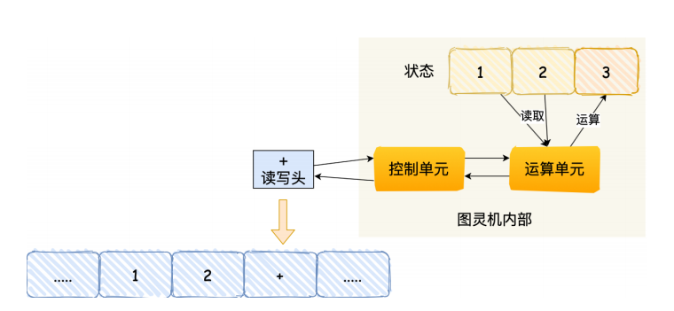

图灵机主要功能就是读取纸带格⼦中的内容，然后交给控制单元识别字符是数字还是运算符指令，如果是数字则存⼊到图灵机状态中，如果是运算符，则通知运算符单元读取状态中的数值进⾏计算，计算结果最终返回给读写头，读写头把结果写⼊到纸带的格⼦中。

### 冯诺依曼模型

遵循了图灵机的设计，提出用电子元件构造计算机，约定了⽤⼆进制进⾏计算和存储，还定义计算机基本结构为 5 个部分，分别是中央处理器（CPU）、内存、输⼊设备、输出设备、总线。

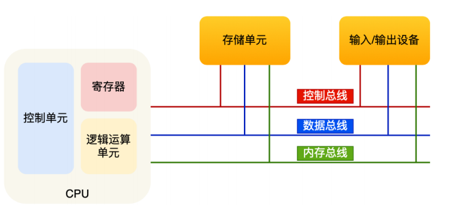

- **内存**

  数据存储的单位是⼀个⼆进制位（bit），即 0 或 1。最⼩的存储单位是字节（byte），1 字节等于 8 位。

- **中央处理器**（CPU）

  控制单元负责CPU工作，逻辑单元负责运算，寄存器种类多，作用不尽相同，CPU中的寄存器主要是存储计算时的数据，加快计算速度。

  常见的寄存器：

  - 通用寄存器：存放要运算的数据。
  - 程序计数器：用来存储CPU下一条要执行指令的内存地址
  - 指令寄存器：存放程序计数器指向的指令，指令被执行完前，都存储在这里。

- **总线**

  负责CPU和其他设备和内存之间的通信

  - 地址总线：指定CPU要操作的内存地址
  - 数据总线：读写内存数据
  - 控制总线：用于发送接收信号，比如中断等，CPU收到信号后进行响应。

  CPU读取数据需要先依靠地址总线指定内存地址，然后通过数据总线传输数据。

- 输入、输出设备

  输入输出设备向计算机输入数据，计算机计算后进行输出，如果输入设备是键盘，需要控制总线进行交互。

  

  

  **程序执行基本过程**

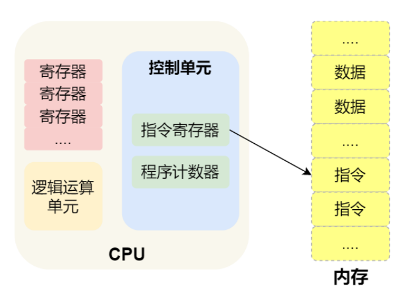

简单总结⼀下就是，⼀个程序执⾏的时候，CPU 会根据程序计数器⾥的内存地址，从内存⾥⾯把需要执⾏的指令读取到指令寄存器⾥⾯执⾏，然后根据指令⻓度⾃增，开始顺序读取下⼀条指令。

### 存储器

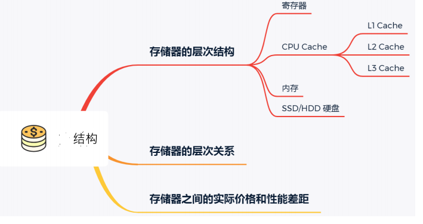

#### **CPUCache**

CPU Cache用的是SRAM（Static Random-Access Memory）的芯片，只要有电数据才能保持存在，1bit数据需要6个晶体管保存，存储密度不高但电路简单访问快。

- L1

  L1分为数据缓存和指令缓存，访问速度极快，通常只需要2-4个时钟周期，大小在几十KB到几百KB。

- L2

  通常几百KB到几MB不等，访问速度在10-20个时钟周期。

- L3

  CPU各核共享L3，大小在几MB到几十MB不等，访问速度在20-60个时钟周期。

##### 缓存数据结构

CPU Cache的数据是从内存中获取，是以Cache Line 为单位读取数据的。

```shell
#查看缓存块大小
cat /sys/devices/system/cpu/cpu0/cache/index0/coherency_line_size
```

对于读取的快，在内存中称为内存块，读取的时候需要拿到数据内存块的地址，**直接映射Cache**采用的策略是取模运算，运算的结果就是内存块地址对应的CPU Line的地址。还有全相连 Cache （*Fully Associative Cache*）、组相连 Cache（*Set Associative Cache*）等。

比如内存分32个内存块，CPU有8个CPU Line，要访问15号内存块，如果这内存块在缓存中，必在7号CPU Line中，15%8 = 7。为了区分不同的内存块，对应的CPU Line中会存储一个组标记Tag，记录当前CPU Line中存储数据对应的内存块。

CPU Line

- 组标记 TAG
- 具体数据
- 有效位，标记对应CPU Line中的数据是否有效，0代表无效。

CPU从CPU Cache读取数据时，不会读取整个数据块，而是读取一个片段，称为一个字Word，一个内存的访问地址包括：

- 组标记
- CPU Line索引
- 偏移量

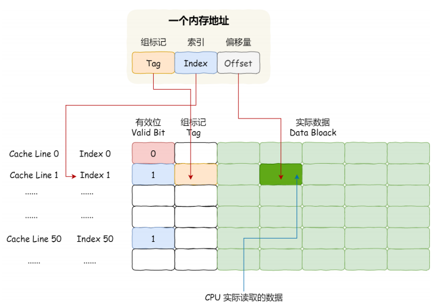

##### 缓存一致性

把CPU缓存中的数据写回内存的方式

- 写直达（Write Through）

  把数据同时写入内存和Cache。

- 写回（Write Back）

  发生写操作时，新的数据被写入缓存快中，只有当修改过的缓存块被替换时才需要写到内存中。

同步不同CPU核心的数据需要保证：

- 写传播

  （某个CPU核心的Cache更新，需要传播到其他核心）

写传播主要依靠总线嗅探机制实现，每次修改都把事件广播通知所有核心，每个核心都监听总线的广播事件。

- 事务串行化

  某个CPU核心里对数据的操作顺序，其他核心看来都是一样的。比如数据A，核心1改为100，核心2改为200，核心C看到数据从100变到200，核心D看到数据从200变到100，就不符合串行化。

MESI协议基于总线嗅探协议实现了事务的串行化，用状态机机制降低了总线压力。对已修改或独占状态的CPU Line 修改更新数据不需要发送广播。

- I  （Invalid）已失效
- E   (Exclusive) 独占
- S （Shared）共享
- M （Modified）已修改

CPU读：MES 都可以被读取 ，I只能从主内存读取。

CPU写：ME可以写，S写需要把其他CPU中的缓存置为无效才行。 然后这个设置过程可能会阻塞，为了避免阻塞带来的资源浪费，引入了store bufferes，写入共享数据直接写入buffer中，同时发送消息给其他CPU，最后再把缓存同步到主内存。 但这又会引发指令重排序。缓存还没刷新就执行后序指令。 因此CPU层面提供内存屏障，让软件层面可以决定在适当的地方插入内存屏障禁止指令重排序。

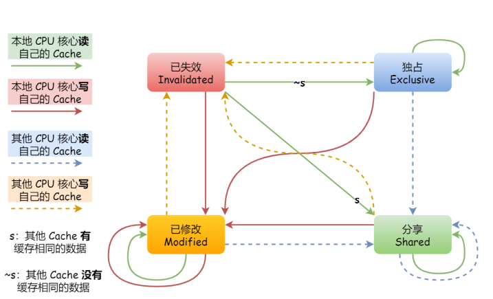

#### **寄存器**

32位CPU大多数寄存器能存储4字节，64位能存储8字节。 访问速度非常快，一般要求在半个时钟周期完成读写，时钟周期和CPU主频相关，比如2GHZ主频的时钟周期是1/2G，即0.5ns。

1GHz的CPU，指的是时钟频率是1G，1秒会产生1G次数的脉冲信号，每次脉冲信号高低电平的转换就是一个周期，称为时钟周期。

#### **内存**

内存⽤的芯⽚和 CPU Cache 有所不同，它使⽤的是⼀种叫作 DRAM （Dynamic Random Access Memory，动态随机存取存储器） 的芯⽚。晶体密度更高，功耗更低，造价便宜，存储一个bit数据只要一个晶体管和一个电容，因为数据存储在电容，电容会不断漏电，所以要定时刷新电容才能保证数据不丢失，所以叫动态存储器，访问速度在200-300个时钟周期之间。

#### **SSD**/**HDD**

SSD结构和内存类似，但断电后数据会保留，内存读写速度大概是SSD的10-1000倍。 机械硬盘访问速度比内存慢10W倍左右。

#### **访问过程**

另外，当 CPU 需要访问内存中某个数据的时候，如果寄存器有这个数据，CPU 就直接从寄存器取数据即可，如果寄存器没有这个数据，CPU 就会查询 L1 ⾼速缓存，如果 L1 没有，则查询 L2 ⾼速缓存，L2 还是没有的话就查询 L3 ⾼速缓存，L3 依然没有的话，才去内存中取数据。

```shell
 #index0、1、2、3分别代表L1数据 L1指令 L2 L3缓存
 cat /sys/devices/system/cpu/cpu0/cache/index?/size
```

### 任务执行

CPU从内存读取数据是以缓存行为单位。缓存行一般64字节大小。

#### 伪共享

多个线程读取一个Cache Line的不同变量，导致缓存频繁失效的现象称为伪共享。

解决：

- 1.通过linux宏设置变量对齐地址。
- JAVA中Disruptor框架使用字节填充+继承避免伪共享。
- JAVA中后续的注解也支持解决避免伪共享问题。

#### 完全公平调度

平常基本都是普通任务，Linux实现了基于CFS的调度算法，完全公平调度，给每个任务分配一个虚拟运行时间，一个任务运行的时间越久，vruntime越大。 Nice值和权重有关。


#### CPU运行队列

每个CPU有自己的运行队列，描述在CPU上运行的所有进程，包括deadline队列dl_rq、实时任务运行队列rt_rq和CFS运行队列csf_rq，csf_rq是红黑树描述的，按vruntime大小排序，最左侧的叶子结点就是下次要被调度的任务。

这⼏种调度类是有优先级的，优先级如下：Deadline > Realtime > Fair，这意味着 Linux 选择下⼀个任务执⾏的时候，会按照此优先级顺序进⾏选择，也就是说先从 dl_rq ⾥选择任务，然后从rt_rq ⾥选择任务，最后从 csf_rq ⾥选择任务。因此，**实时任务总是会⽐普通任务优先被执⾏**。

### 内核

内核是应用连接硬件设备的桥梁。管理进程调度，管理内存，管理硬件，提供系统调用给应用程序。

Linux的设计理念

- MutiTask

  多任务

- SMP

  对称多处理，每个程序都可以被分配到任意一个CPU执行。

- ELF

  可执行文件链接格式

## 调度算法


### 进程调度

当 CPU 空闲时，操作系统就选择内存中的某个「就绪状态」的进程，并给其分配 CPU。调度算法分为抢占式和非抢占式。

#### 先来先服务（FCFS）

每次从队列中选择最先进入队列的进程，一直运行，直到进程退出或被阻塞。

利于长作业，不利于短作业。适用于CPU繁忙型作业的系统，不适用于I/O繁忙的系统。


#### 最短作业优先(SJF)

会优先选择运行时间最短的进程运行。

对长作业不利。

#### 高响应比优先调度（HRRN）

每次调度前，计算响应比优先级，然后运行优先级最高的进程。

优先权=（等待时间+要求服务时间）/	要求服务时间

#### 时间片轮转调度算法

每个进程被分配一个时间段，允许进程在改时间段运行。时间片的设置需要注意，否则会导致过多的上下文切换，影响效率。通常设置为20-50ms。

#### 最高优先级调度算法（HPF）

从就绪队列中选择最高优先级的进程运行。

- 静态优先级

  创建时确定了优先级，不会变化。

- 动态优先级

  根据进程的变化动态调整优先级，比如随运行时间增加而增加。

  处理优先级高的任务也可以以抢占式、非抢占式运行。

#### 多级反馈队列算法

是时间片轮转算法+最高优先级算法的综合和发展。多级指多个队列，反馈指如果有新的进程加入优先级高的队列，立刻停止正在运行的进程，转去运行优先级高的队列。

- 多个队列，优先级高到低，优先级越高时间片越短。
- 新的进程会被放入第一层队列末尾，时间片到了没有完成就转入下一层队列。
- 当高优先级的队列为空才会调度低优先级队列中的任务。

兼顾了长短作业，拥有较好的响应时间。

### 页面置换

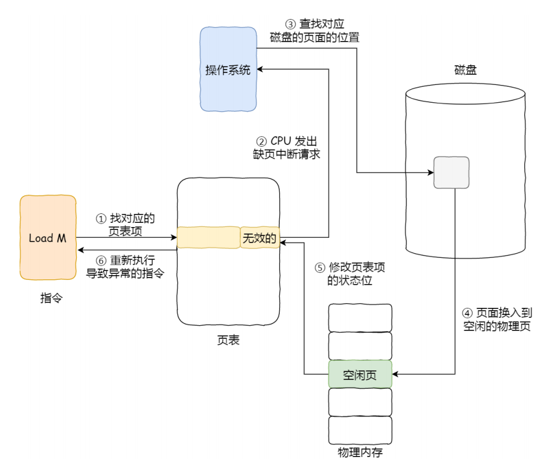

⻚⾯置换算法的功能是，**当出现缺⻚异常，需调⼊新⻚⾯⽽内存已满时，选择被置换的物理⻚⾯**，也就是说选择⼀个物理⻚⾯换出到磁盘，然后把需要访问的⻚⾯换⼊到物理⻚

#### OPT

最佳页面置换，置换未来最长时间不访问的页面。

#### FIFO

先进先出，选择在内存中驻留时间最长的页面置换。

#### LRU

选择最长时间未被访问的页进行置换。

#### Lock

维护一个包含所有页的环形链表，一个表指针指向最老的页，发生中断时，检查表针指向的页面，如果访问位为0就直接淘汰这个页面，如果为1就清除访问位。

#### LFU

选择访问次数最少的页面淘汰。

### 磁盘调度

#### FCFS

先来先服务

#### SSF

最短寻道优先，优先选择从当前磁头位置所需寻道时间最短的请求，可能存在部分请求饥饿问题。

#### Scan

扫描算法（电梯算法），磁头在一个方向上移动，访问所有未完成的请求，直到到达这个方向的最后磁道，才改变方向。中间磁道的响应频率好一些。

#### CSCAN

循环扫描，只有磁头朝特定的方向移动，才处理磁道访问请求，返回时则快速复位磁头到边缘，返回途中不处理请求。

#### LOOK和C-LOOK

和Scan和CSCAN基本相同，唯一区别是磁头移动到最远请求位置后就立即反向移动。

## 内存管理

### 虚拟内存

> https://note.youdao.com/ynoteshare1/index.html?id=7e94fa90afb813c0dab858cb9d64d30d&type=notebook#/16CF6F8BEED24D6B9A3E8AE2C528C9E5

### 内存管理

> https://blog.csdn.net/ajian005/article/details/18236585

#### 连续内存分配方式


#### 内存分配算法

> https://www.cnblogs.com/HelloBytes/p/13159948.html

- 首次适应算法

  遍历内存链表（表），找到第一个合适的空闲空间分配，分割这个区域，一部分使用，一部分还给空闲区。

- 循环首次适应算法

  和上一个的区别是扫描会从上一次找到的合适位置开始扫描。

- 最优适应算法

  扫描整个内存表，找一个最适合的空间分配，不分割区域，分配内存后对内存表重排列。

- 最坏适应算法

  一般把内存表从大到小排列，每次分配只需分配第一个，分配效率高。

## 网络系统

### DMA和零拷贝（直接内存访问）

**在进⾏** **I/O** **设备和内存的数据传输的时候，数据搬运的⼯作全部交给DMA** **控制器，⽽** **CPU** **不再参与任何与数据搬运相关的事情，这样** **CPU** **就可以去处理别的事务**

传统IO

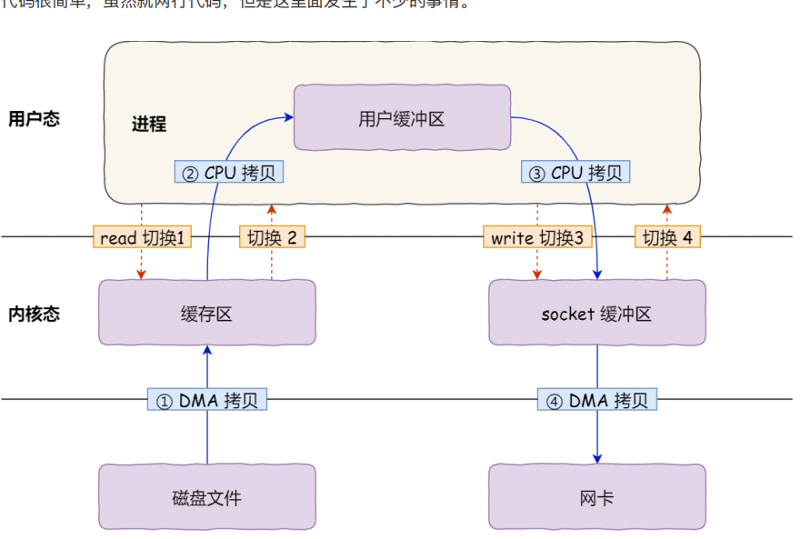

mmap

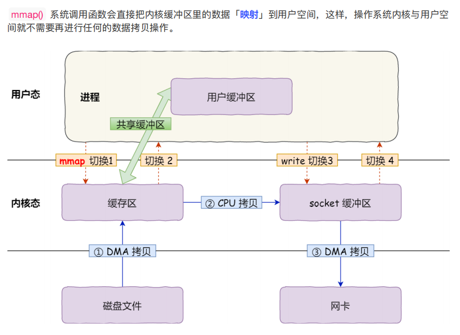

sendfile

在 Linux 内核版本 2.1 中，提供了⼀个专⻔发送⽂件的系统调⽤函数 sendfile()

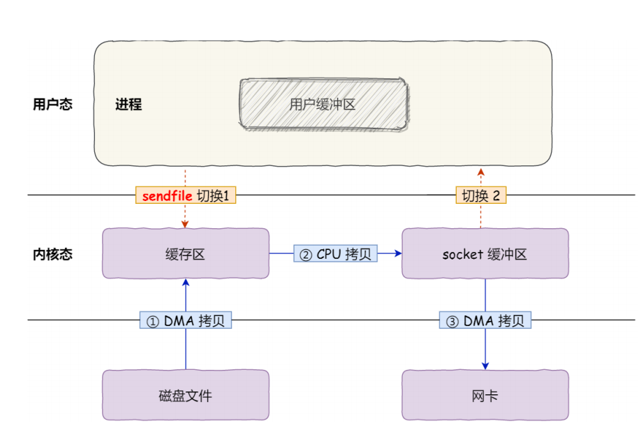

真.零拷贝

所有数据通过DMA传输。

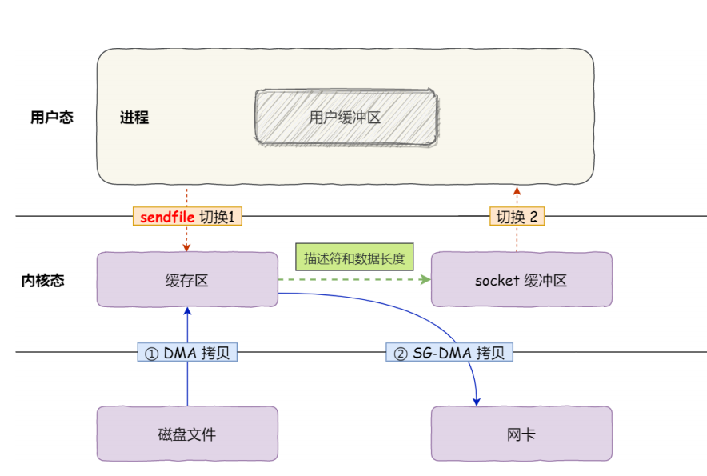

PageCache，内核缓冲区其实就是磁盘高速缓存，是内存的一部分。主要用于缓存最近被访问的数据，拥有预读功能，缓存最近访问的数据。

传输大文件的时候，内核缓冲区不起作用。因为这样会导致pagecache被占满影响小数据的读取。这时可以用异步IO或直接IO解决大文件传输。

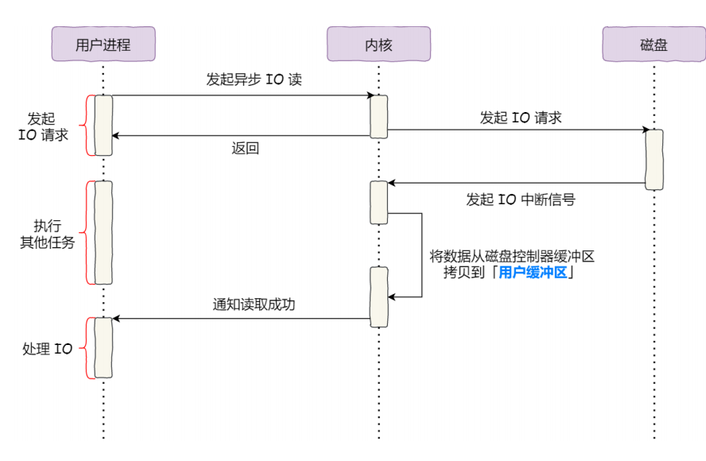

### IO多路复用

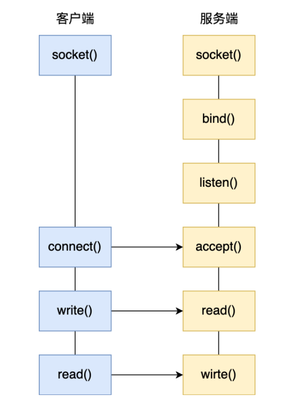

#### SELECT

select 实现多路复⽤的⽅式是，将已连接的 Socket 都放到⼀个**⽂件描述符集合**，然后调⽤ select 函数将⽂件描述符集合**拷⻉**到内核⾥，让内核来检查是否有⽹络事件产⽣，检查的⽅式很粗暴，就是通过**遍历**⽂件描述符集合的⽅式，当检查到有事件产⽣后，将此 Socket 标记为可读或可写， 接着再把整个⽂件描述符集合**拷⻉**回⽤户态⾥，然后⽤户态还需要再通过**遍历**的⽅法找到可读或可写的 Socket，然后再对其处理。

所以，对于 select 这种⽅式，需要进⾏ **2** **次「遍历」⽂件描述符集合**，⼀次是在内核态⾥，⼀个次是在⽤户态⾥ ，⽽且还会发⽣ **2** **次「拷⻉」⽂件描述符集合**，先从⽤户空间传⼊内核空间，由内核修改后，再传出到⽤户空间中。select 使⽤固定⻓度的 BitsMap，表示⽂件描述符集合，⽽且所⽀持的⽂件描述符的个数是有限制的，在Linux 系统中，由内核中的 FD_SETSIZE 限制， 默认最⼤值为 1024 ，只能监听 0~1023 的⽂件描述符。

#### POLL

poll 不再⽤ BitsMap 来存储所关注的⽂件描述符，取⽽代之⽤动态数组，以链表形式来组织，突破了select 的⽂件描述符个数限制，当然还会受到系统⽂件描述符限制。

但是 poll 和 select 并没有太⼤的本质区别，**都是使⽤「线性结构」存储进程关注的** **Socket** **集合，因此都需要遍历⽂件描述符集合来找到可读或可写的Socket，时间复杂度为O(n)，⽽且也需要在⽤户态与内核态之间拷⻉⽂件描述符集合**，这种⽅式随着并发数上来，性能的损耗会呈指数级增⻓。

#### EPOLL

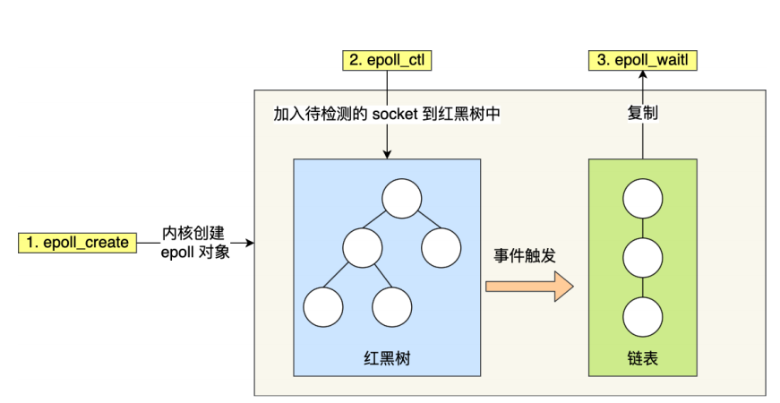

- 使用红黑树跟踪所有描述符
- 参数只要传入待检测的socket，不需要传入整个socket集合，减少了大量的拷贝。
- 维护了一个链表来记录就绪事件，当某个socket有事件发生，通过回调函数内核会把socket加入到就绪事件链表。
- 用户通过复制得到就绪链表。

边缘触发/水平触发


## 文件系统

对Linux来说，一切皆文件，每个文件都有两个数据结构，索引结点（index node）和目录项（directory）。

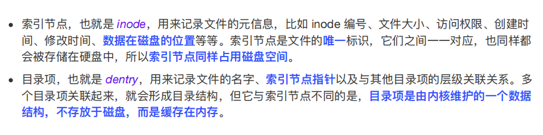

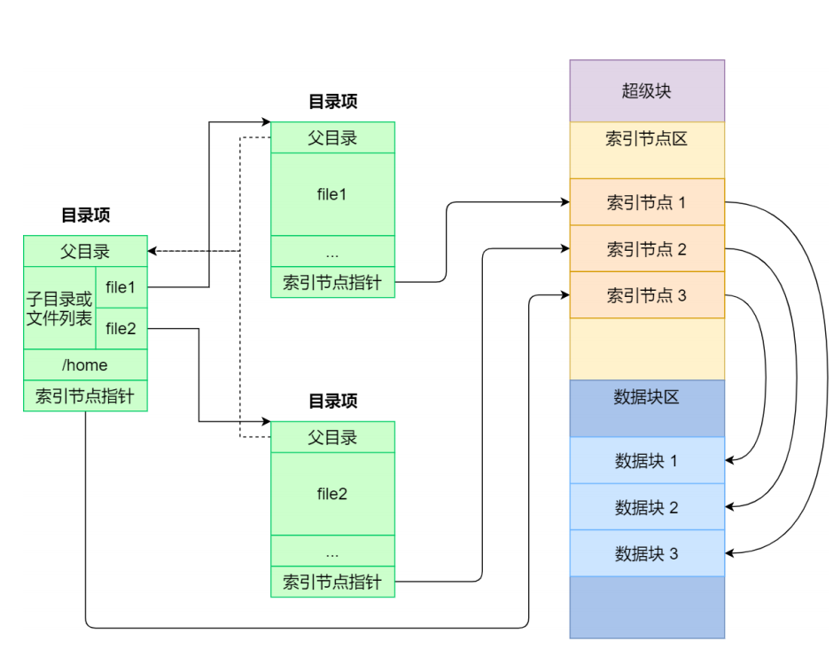

文件系统种类多，操作系统提供统一的接口，VFS。

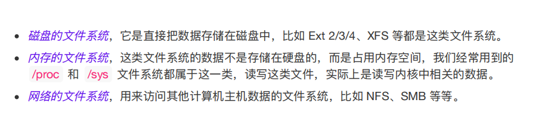


### 文件存储

#### 连续空间

- 读写效率高
- 存在磁盘碎片问题、文件长度不易扩展

#### 非连续空间

##### **链表法**

- 文件头包含第一块和最后一块位置
- 数据可能会丢失

##### **索引法**

- 每个文件维护一个索引块，里面存放指向文件数据块的指针。
- 无碎片、随机顺序读写、创建扩缩容方便。

##### **链表+索引**

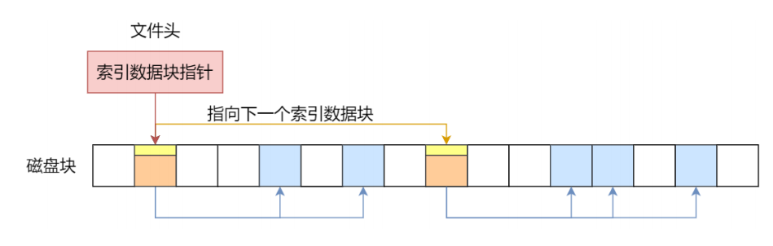

还是存在丢失数据的可能。

##### **多级索引**

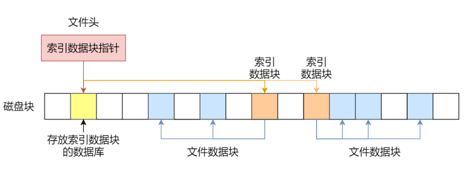

##### **实际**

unix组合了上面各种方式的优点，

文件Innode头里里有13个指针，10个用于小文件，直接指向数据块，后面三个分别是一、二、三级 **多级** 索引指针。

### 空闲空间管理

#### 空闲表

分配磁盘空间时直接扫描空闲表。

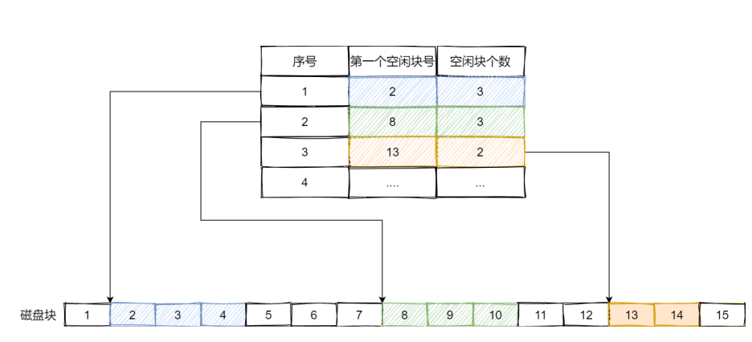

#### 空闲链表

主内存保存一个指针指向第一个空闲块。

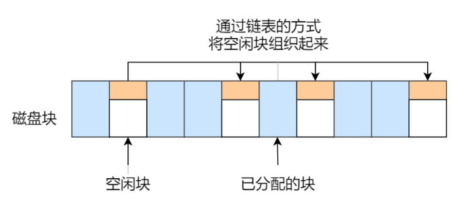

#### 位图

在 Linux ⽂件系统就采⽤了位图的⽅式来管理空闲空间，不仅⽤于数据空闲块的管理，还⽤于 inode 空闲块的管理，因为 inode 也是存储在磁盘的，⾃然也要有对其管理。

linux使用这种方法管理空闲空间，磁盘所有盘快有一个二进制位与其对应。

位图保存在磁盘，如果放在一个快里，一个块4kb，只能保存2^15次方个空闲块，128M。 linux中使用快组来管理文件。

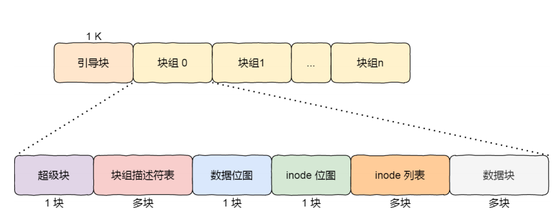

引导快在系统启动时进行启动引导。

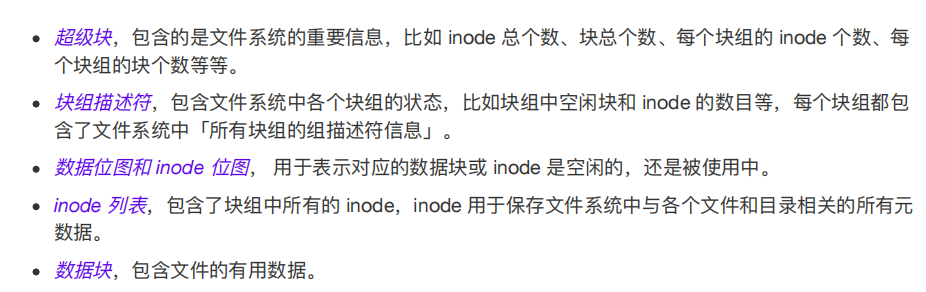

每个快组里有很多重复信息，主要是为了数据冗余，高版本的ext系统使用了稀疏技术，超级快和快组描述符只存放在组0、1和3、5、7的幂的快组中。

### 目录

目录也是文件，也有对应的inode。普通⽂件的块⾥⾯保存的是⽂件数据，⽽⽬录⽂件的块⾥⾯保存的是⽬录⾥⾯⼀项⼀项的⽂件信息。

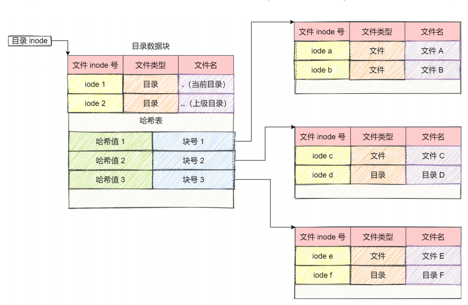

因为我们主要看到的是文件名，点击文件后，找文件可以用文件名的hash值来找，有紧急的备选hash冲突方案。

硬链接是多个⽬录项中的「索引节点」指向⼀个⽂件

软链接相当于重新创建⼀个⽂件，这个⽂件有独⽴的 inode，但是这个⽂件的内容是另外⼀个⽂件的路径，所以访问软链接的时候，实际上相当于访问到了另外⼀个⽂件。

