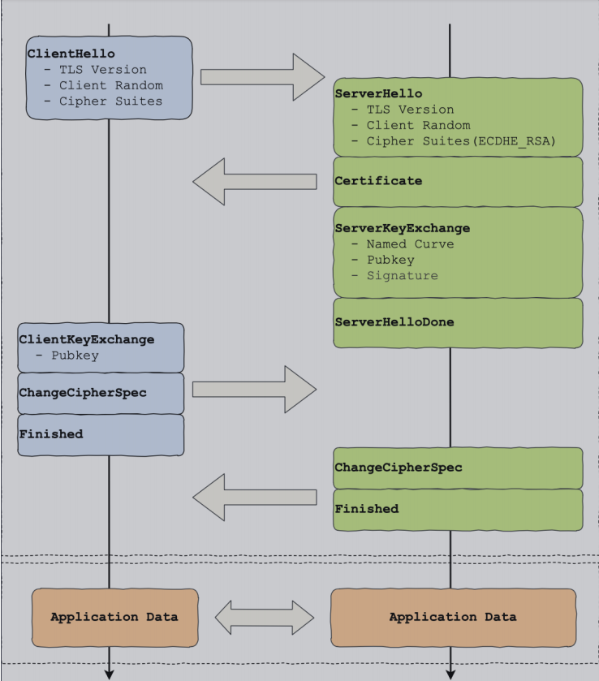
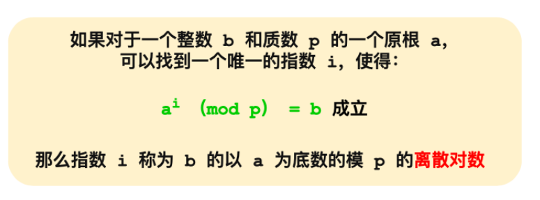
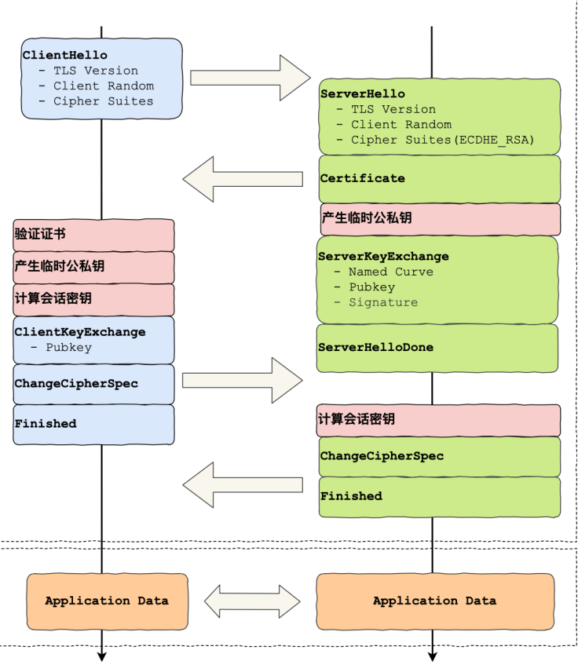
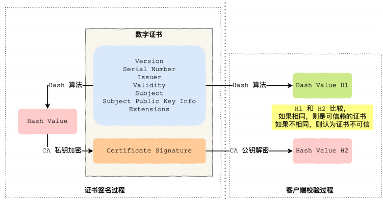
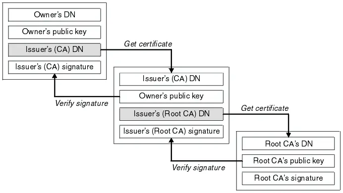
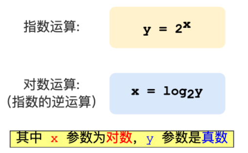

# 计算机网络

## 1.前置基础

### 分层

应用层-》传输层-》网络层-》链路层

应用层-》表示层-》会话层-》传输层-》网络层-》数据链路层-》物理层

### 名词

**RTT(Round-Trip Time):** 往返时延。在计算机网络中它是一个重要的性能指标，表示从发送端发送数据开始，到发送端收到来自接收端的确认（接收端收到数据后便立即发送确认），总共经历的时延。

**MSS(Max Segment Size)** 最大报文段长度，用于在TCP连接建立时，收发双方协商通信时每一个报文段所能承载的最大数据长度（不包括文段头）。

**MTU（Maximum Transmission Unit，MTU）**最大传输单元

**MSL （Maximum Segment Lifetime）**报⽂最⼤⽣存时间，它是任何报⽂在⽹络上存在的最⻓时间

## 2.HTTP

HTTP 是⼀个⽤在计算机世界⾥的**协议**。它使⽤计算机能够理解的语⾔确⽴了⼀种计算机之间交流通信的规范（**两个以上的参与者**），以及相关的各种控制和错误处理⽅式（**⾏为约定和规范**）。

### 1）常见错误码

1XX 属于提示信息，一般是协议处理的中间状态，用的比较少。

2XX 表示服务器成功处理了请求

- 200 OK 一切正常
- 204 No Content 一切正常 但body为空
- 206 Partial Context 表示部分资源处理成功

3XX 表示资源发生了变动，需要重定向

- 301 永久重定向
- 302 临时重定向
- 304 缓存重定向

4XX 表示客户端报文有误

- 400 请求报文有误
- 403 拒绝访问
- 404 找不到该资源

5XX 表示服务器内部处理错误

- 500 未知错误
- 501 不支持该功能
- 502 代理服务器正常 后端服务器异常
- 503 服务器正忙，暂时无法响应

### 2）特性

- 简单

  header+body，头部信息key-value 

- 灵活以扩展 

  请求方法，状态码、头字段等都没被固定死，可自由扩展。

- 应用广跨平台

缺点：明文传输+无状态+不安全

### 3）各版本HTTP

#### HTTP1.1

- 长连接

- 管道网络传输

  允许在一个TCP连接内连续发送多个请求，但服务器还是必须按顺序回应，如果之前的请求回应慢，会出现**队头阻塞**。

- 队头阻塞

#### HTTP2

- 服务端可以主动给客户端发送消息
- 可以在一个连接内并发多个请求或回应，无队头阻塞
- 多个HTTP请求复用一个TCP，如果出现丢包，TCP重传会拖累所有请求。
- 利用静态表和huffman编码，大大压缩头部的体积，静态表压缩效率更高。

#### HTTP3

- TCP协议改为了基于UDP的QUIC协议
- TLS1.2 -> 1.3
- 合并了TCP的三次握手+TLS/1.3的三次握手 总共变为3次

### 优化

- 缓存

  客户端请求带上本地缓存的摘要，服务端看情况返回结果。

- 重定向

  代理服务器记录重定向信息，让下次客户端不需要重定向，减少请求次数。

- 合并请求

  多个小资源合并为一个大资源，客户端自行拆包，但一个小资源改变后客户端可能要重新下载大资源。

- 延迟发送请求

- 通过压缩技术压缩响应体大小

### 补充

HTTP头有字段标明body用的什么编码，所以我比较好奇头部是怎么编码的，发现HTTP的约定是头部固定用ASICC编码，所以请求头不能有中文。

## 3.HTTPS

通过在HTTP和TCP层之间加入TLS（Transport Layer Security）协议，解决HTTP的安全问题。SSL安全套接字层演变为了TLS协议。

### 1）TLS握手

4个消息可以完成TLS握手，2个RTT时延。

### 2）RSA秘钥交换算法

传统的 TLS 握⼿基本都是使⽤ RSA 算法来实现密钥交换的，在将 TLS 证书部署服务端时，证书⽂件中包含⼀对公私钥，其中公钥会在 TLS 握⼿阶段传递给客户端，私钥则⼀直留在服务端，⼀定要确保私钥不能被窃取。

在 RSA 密钥协商算法中，客户端会⽣成随机密钥，并使⽤服务端的公钥加密后再传给服务端。根据⾮对称加密算法，公钥加密的消息仅能通过私钥解密，这样服务端解密后，双⽅就得到了相同的密钥，再⽤它加密应⽤消息。

密码套件：Cipher Suite: TLS_RSA_WITH_AES_128_GCM_SHA256
秘钥交换算法+签名算法+对称加密算法+摘要算法（用于证书认证）WITH只有一个RSA，说明秘钥交换和签名算法都是RSA算法。

缺陷：不支持前向保密，一旦服务器私钥泄漏，所有密文都会被破解。

### 3）DH算法

通信双方先确认模数p和底数a。然后各自生成一个随机数作为私钥（对数）。公钥就是对应的真数。

b1 = a^i1 (mod p)
b2 = a^i2 (mod p)

b2^i1 (mod p) = k

b1^i2 (mod p) = k

k就是会话秘钥

### 4）DHE算法

DH算法的实现分两种

- static DH

  有一方的私钥是静态的，一般是服务端，依然会有前向安全问题。

- DHE

  E->ephemeral（临时的）每次双方都随机生成秘钥，保证前向安全。

### 5）ECDHE

DHE 算法由于计算性能不佳，因为需要做⼤ᰁ的乘法，为了提升 DHE 算法的性能，所以就出现了现在⼴泛⽤于密

钥交换算法 —— **ECDHE** **算法**。

ECDHE 算法是在 DHE 算法的基础上利⽤了 ECC 椭圆曲线特性，可以⽤更少的计算量计算出公钥，以及最终的会话密钥。

使用了ECDHE，在第四次握手前就已经发送了加密数据，省去了一个消息往返的时间，称为TLS Fast Start。在第二次握手中，会出现Server Key Exchange消息。

优化点

- 选择支持AES-NI特性的CPU，指令上优化了AES算法

- 秘钥交换算法尽量选择ECDHE替换RSA

- 对称加密算法选择AES_128_GCM 比较短，速度更快

- TLS从1.2升级为1.3
  完成握手只要1个RTT，一个RTT完成握手，只支持ECDHE算法，只支持最安全的几个密码套件。TLS1.3重连只需要0RTT，即直接把ticket和HTTP请求一起发送给服务端，叫Pre-shared Key。

- 证书优化，选择ECDSA证书替换RSA证书

- 证书验证优化

  CRL（**Certificate Revocation List**）

  CA定期更新调销信任的证书序号列表。（实时性差 列表越来越大，下载慢）

  OCSP（*Online Certificate Status Protocol*）

  主流使用的，向CA发送查询请求，CA返回证书有效状态。**OCSP Stapling**是服务端的一个优化，服务端定期查询证书状态，CA返回加密的签名给服务端，服务端把这个签名一起发给用户端。

- SESSION ID，双方首次建立连接后，在内存缓存会话秘钥，用唯一的SESSION ID标识，下次启用连接直接恢复会话，1RTT建立安全通信。（可能会出现负载均衡问题）

- Session Ticket

  服务器把缓存的工作交给服务端，解密Ticket后取出秘钥，验证有效期，没问题就恢复会话。 但sessionid和ticket都有可能会产生重放攻击，需要对秘钥设定一个合理的过期时间，只对GET请求使用ticket。

### 数字证书

通常包含公钥+CA信息+持有者信息+CA的签名和使用的加密算法+证书过期时间+其他信息

**证书链**

但事实上，证书的验证过程中还存在⼀个证书信任链的问题，因为我们向 CA 申请的证书⼀般不是根证书签发的，⽽是由中间证书签发的。 

### 离散对数

上图的，底数 a 和模数 p 是离散对数的公共参数，也就说是公开的，b 是真数，i 是对数。知道了对数，就可以⽤

上⾯的公式计算出真数。但反过来，知道真数却很难推算出对数。

**特别是当模数p是⼀个很⼤的质数，即使知道底数a和真数b ，在现有的计算机的计算⽔平是⼏乎⽆法算出离散对数的，这就是DH算法的数学基础。**

## 4.TCP

TCP基础在有道云笔记

> 基础篇：https://note.youdao.com/ynoteshare1/index.html?id=7e94fa90afb813c0dab858cb9d64d30d&type=notebook#/A029131FA25B45D79E6324DE87C75529
>
> 高级篇：https://note.youdao.com/ynoteshare1/index.html?id=7e94fa90afb813c0dab858cb9d64d30d&type=notebook#/B46157F0280546C1BBA10DA33FF45803
>
> 

TCP抓包

> 基本教程：https://www.cnblogs.com/chyingp/p/linux-command-tcpdump.html

